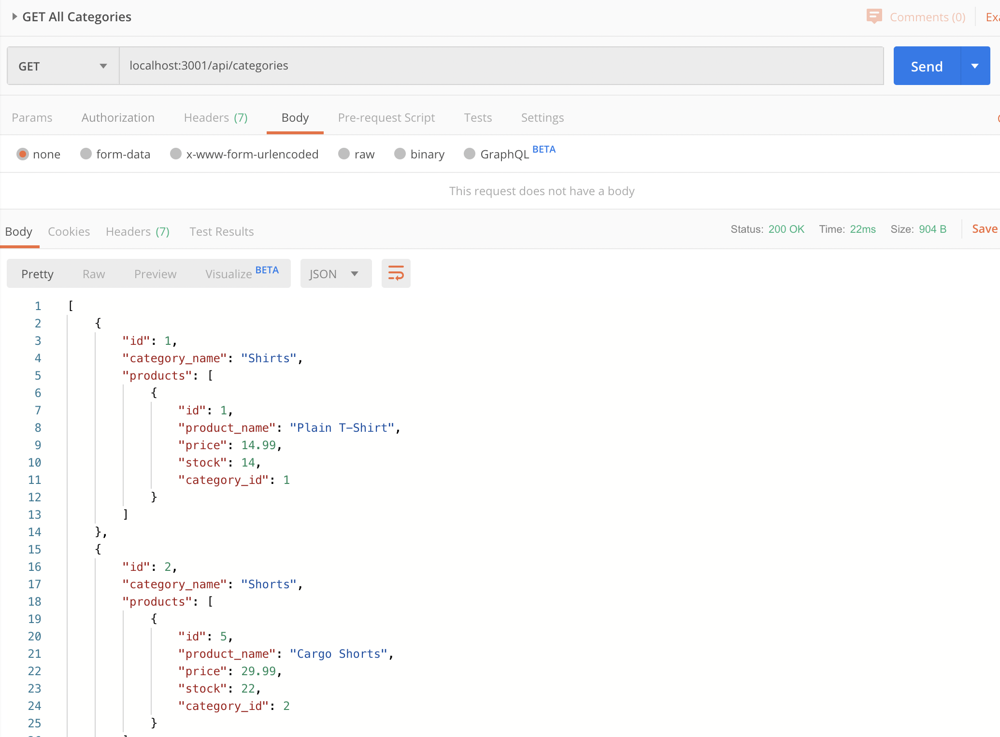
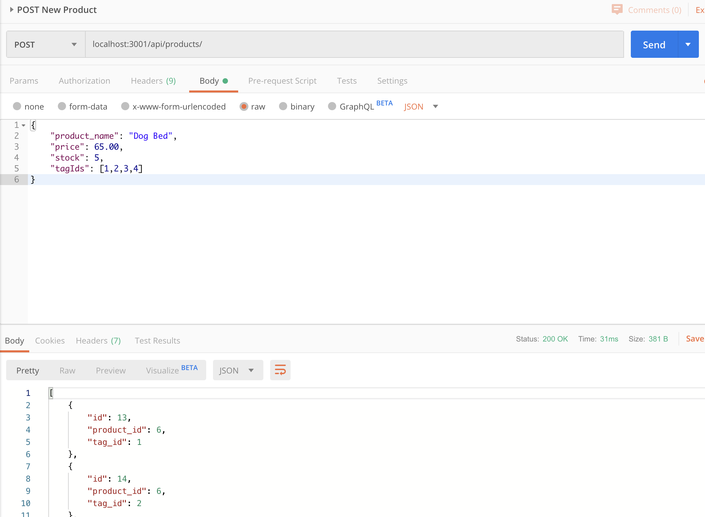
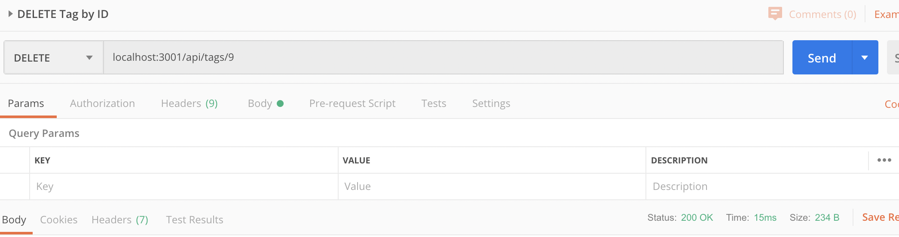

# eCommerce-BackEnd
## Overview
This application is best utilized to keep track of inventory in a database. You can get all categories, products, and tags, as well as get an item in all fields by ID, enter new data in all fields, update any of the data by ID, and delete any field by ID. 

## Usage
Since this demonstrates backend capabilities, it is best used in an application like Postman or Insomnia to create, read, update, or delete any data. 

## Installation
The tools required to run this application are a resource like Postman or Insomnia, MySQL Workbench, node, sequelize, and express. 

## Link to Demo
If you'd like to watch a recorded demo using this application, feel free to [click here](https://drive.google.com/file/d/1w38YPMOBq2YAaeZ8SiOUVMA5G8sBW6rR/view?usp=sharing). 
## License
MIT License

Copyright (c) 2021 Kelsey Benedict

Permission is hereby granted, free of charge, to any person obtaining a copy
of this software and associated documentation files (the "Software"), to deal
in the Software without restriction, including without limitation the rights
to use, copy, modify, merge, publish, distribute, sublicense, and/or sell
copies of the Software, and to permit persons to whom the Software is
furnished to do so, subject to the following conditions:

The above copyright notice and this permission notice shall be included in all
copies or substantial portions of the Software.

THE SOFTWARE IS PROVIDED "AS IS", WITHOUT WARRANTY OF ANY KIND, EXPRESS OR
IMPLIED, INCLUDING BUT NOT LIMITED TO THE WARRANTIES OF MERCHANTABILITY,
FITNESS FOR A PARTICULAR PURPOSE AND NONINFRINGEMENT. IN NO EVENT SHALL THE
AUTHORS OR COPYRIGHT HOLDERS BE LIABLE FOR ANY CLAIM, DAMAGES OR OTHER
LIABILITY, WHETHER IN AN ACTION OF CONTRACT, TORT OR OTHERWISE, ARISING FROM,
OUT OF OR IN CONNECTION WITH THE SOFTWARE OR THE USE OR OTHER DEALINGS IN THE
SOFTWARE.